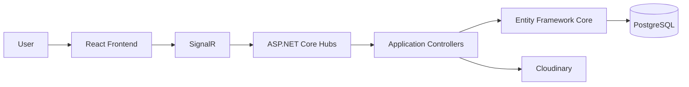

# Prototipo-IdS

**Bachelor's thesis project — Computer Engineering, University of Bologna**

A full-stack real-time platform for creating groups, organizing events and enabling live interaction between users.

The project was developed as my Bachelor's thesis project and focuses on the design and implementation of a complete multi-user web application, from the data model and backend services to the React interface and real-time communication layer.

## Project overview

Prototipo-IdS models a social event-management platform where users can:

- create and manage groups
- create, propose and share events
- participate in group and event activities
- exchange real-time messages
- manage users and group administrators
- search users, groups and events
- upload and manage images

## Architecture



The application uses a layered full-stack architecture:

- **React** for the user interface and client-side navigation
- **ASP.NET Core / .NET 8** for backend services
- **SignalR** for real-time client/server communication
- **Entity Framework Core** for persistence
- **PostgreSQL** as the relational database
- **Cloudinary** for image storage

## Tech stack

| Area | Technologies |
| --- | --- |
| Frontend | React, React Router |
| Backend | ASP.NET Core, .NET 8 |
| Real-time communication | SignalR |
| Database | PostgreSQL |
| ORM | Entity Framework Core |
| Media storage | Cloudinary |
| Language | JavaScript, C# |

## Backend structure

The backend is organized around dedicated controllers, domain models and SignalR hubs.

### SignalR hubs

The project includes hubs for:

- authentication
- chat
- groups
- events
- shared events
- users
- home/dashboard updates
- administration
- search

This allows the frontend to receive updates without relying exclusively on request/response interactions.

### Domain model

The relational model includes entities for:

- users
- groups
- group participants and administrators
- events
- event participants and organizers
- event proposals
- shared events
- invitations
- messages

This was one of the main engineering aspects of the thesis: translating the application requirements into a coherent relational and object-oriented domain model.

## Frontend

The React client provides dedicated views for authentication, groups, events, chat and user interactions.

The frontend communicates with the backend through a service layer and SignalR connections, keeping UI components separated from communication logic.

## Thesis focus

The project was used to explore the complete engineering lifecycle of a non-trivial web application:

1. requirements and domain modelling
2. relational database design
3. backend architecture
4. real-time communication
5. frontend integration
6. persistence and media handling
7. integration of the complete system

A more detailed technical overview is available in [docs/ARCHITECTURE.md](docs/ARCHITECTURE.md).

## Local configuration

Sensitive credentials are intentionally not stored in the repository.

Before running the backend, configure:

- PostgreSQL connection string
- Cloudinary cloud name
- Cloudinary API key
- Cloudinary API secret

These can be supplied through ASP.NET Core configuration/environment variables, for example:

```text
ConnectionStrings__DefaultConnection
Cloudinary__CloudName
Cloudinary__ApiKey
Cloudinary__ApiSecret
```

## Repository structure

```text
Prototipo-IdS/
├── BackEnd/
│   ├── Controller/
│   ├── Hubs/
│   ├── Model/
│   ├── Service/
│   └── Program.cs
├── FrontEnd/
│   ├── public/
│   └── src/
└── docs/
```

## Academic context

**Bachelor's Thesis Project**  
Computer Engineering  
University of Bologna

This repository is preserved as an academic project and portfolio showcase.
