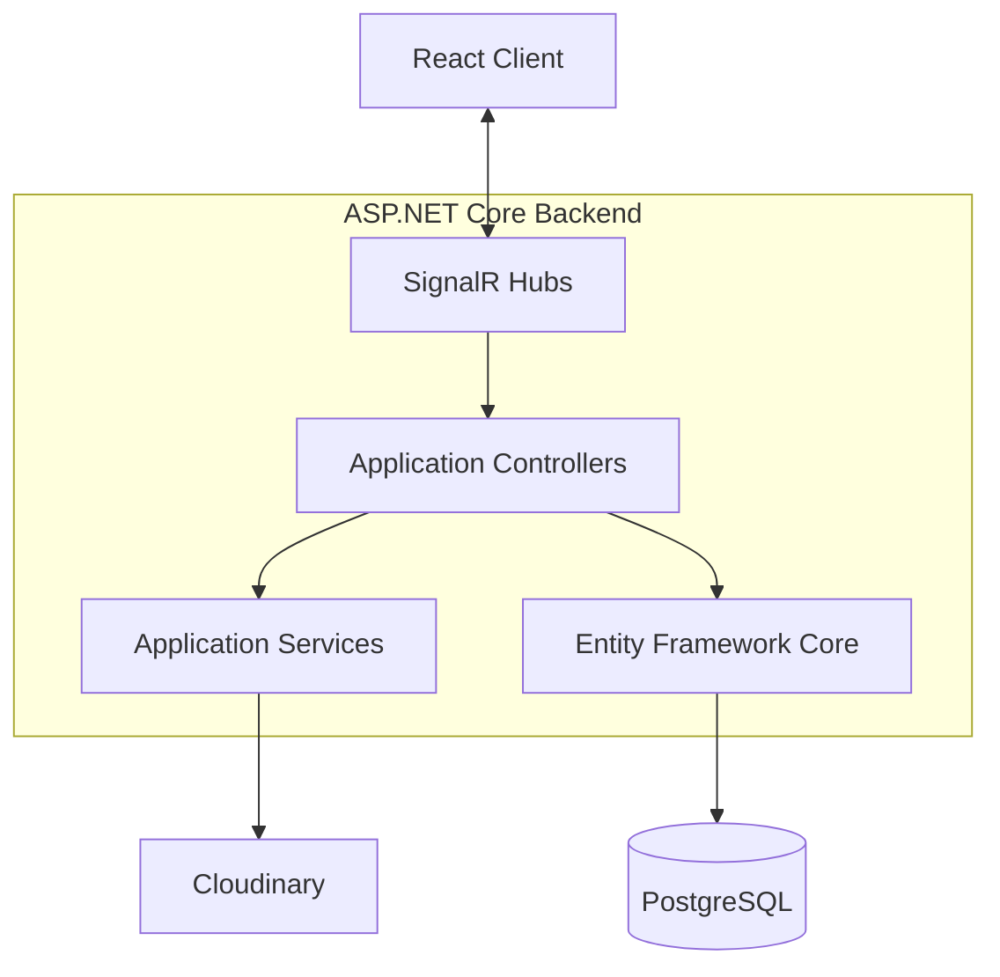

# Architecture

Prototipo-IdS is a full-stack real-time web application developed as a Bachelor's thesis project in Computer Engineering at the University of Bologna.

## High-level architecture

## Frontend

The frontend is implemented in React and organized around:

- authentication
- group management
- event management
- chat
- user profile and sidebar components
- search
- service modules for backend communication

Real-time connections are managed through SignalR.

## Backend

The backend uses ASP.NET Core and separates responsibilities into:

- controllers for application logic
- SignalR hubs for real-time communication
- domain models
- Entity Framework Core persistence
- media services

Dedicated hubs exist for authentication, chat, groups, events, shared events, users, administration, search and home/dashboard updates.

## Persistence

The relational model is implemented with Entity Framework Core and PostgreSQL.

Representative domain entities include:

- `Utente`
- `Gruppo`
- `Evento`
- `Messaggio`
- `Invito`
- `PropostaEvento`
- `EventoCondiviso`
- participant/administrator/organizer relationship entities

The schema models many-to-many relationships and role-specific associations explicitly.

## Real-time communication

SignalR is used as the main live communication layer between frontend and backend.

This enables the application to update chat, group/event state and other UI elements in real time without requiring constant polling.

## Media

Cloudinary is integrated through a dedicated image service. Credentials are provided through external configuration and are not stored in the public repository.

## Engineering scope

The project demonstrates:

- layered application architecture
- object/relational domain modelling
- real-time distributed communication
- frontend/backend integration
- dependency injection
- persistence with an ORM
- media-service integration
- multi-user application design

## Portfolio note

The source code is preserved as the original academic implementation. Portfolio changes are intentionally limited to documentation and removal of tracked credentials.
